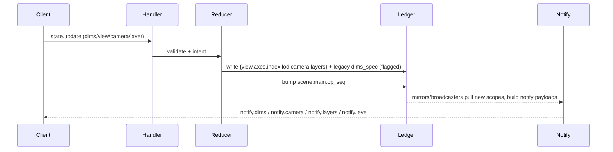
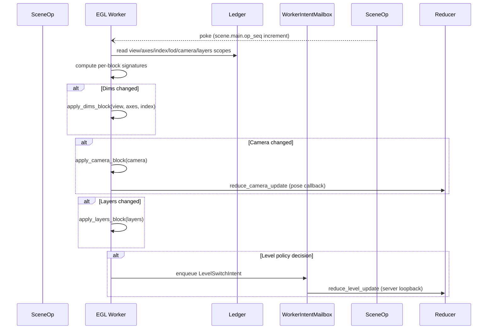

View/Axes/Index/Lod/CAMERA Migration Plan
=========================================

Purpose
-------

Provide an execution-ready plan—diagrams plus task breakdown—for replacing the
legacy `dims_spec` + planner/mailbox stack with the factored ledger model
(`view / axes / index / lod / camera / layers`) and direct worker apply path.
Treat this as the canonical reference for sequencing, scope boundaries, and
temporary shims.

Target Call Stacks
------------------

### Control → Ledger → Notify

Key points:
- Reducers dual-write new scopes **and** legacy `dims_spec` until consumers flip.
- Notify builders read the new scopes first, falling back to `dims_spec`.
- No planner/mailbox involvement; ledger is the only truth source.

### Worker Tick (Ledger → Apply Blocks → Intents)

Key points:
- `RenderUpdateMailbox`, `ViewportPlanner`, `PlaneState`/`VolumeState`, and the
  apply shims disappear.
- Only `WorkerIntentMailbox` remains (level intents, thumbnail captures).
- Ledger scopes are read directly each tick; per-block signatures prevent
  redundant reapply.

Issue Breakdown (Phased)
------------------------

### Phase 0 — Ledger Restructure (no behavioral change)
1. **Move ledger module**: rename `state_ledger/__init__.py` → `ledger.py`; fix imports.
2. **Create `scene/blocks/` package**:
   - `legacy_dims_spec.py` (current `DimsSpec` + helpers).
   - `view_state.py`, `axes_state.py`, `index_state.py`, `lod_state.py`,
     `camera_state.py`, `layer_state.py` (empty shells with dataclasses + serializers).
3. **Add feature flag plumbing** (`LEDGER_VIEW_AXES_V1`) shared by reducers/scene builders/worker.

### Phase 1 — Dual-write new scopes
1. Reducers/transactions write new blocks + legacy `dims_spec`.
2. Unit tests assert parity between `dims_spec` and the new scopes (indexes, modes, margins, level).
3. Scene builders encode the new blocks into `RenderLedgerSnapshot` but keep legacy fields populated.

Temporary patching:
- Worker/runtime still read only legacy fields.
- Notify payloads still emit `dims_spec` at top level.

### Phase 2 — Consumer flip (outside-in)
1. **Notify pipeline**: `notify.dims` emits both the new blocks and legacy spec;
   mirrors/clients start reading `{view,axes,index,lod}` first.
2. **Snapshot builder → worker**: expose the new blocks to the worker under a
   feature flag; start building per-block signatures.
3. **Runtime apply rewrite**:
   - Implement `apply_dims_block`, `apply_camera_block`, `apply_layers_block`
     that accept the new models.
   - Introduce a new worker tick that bypasses `RenderUpdateMailbox`.
   - Keep the legacy planner/mailbox path behind a fallback flag for staged rollout.

### Phase 3 — Legacy removal
1. Delete `ViewportPlanner`, `PlaneState`, `VolumeState`, `RenderUpdateMailbox`,
   bootstrap camera helpers, and all planner/apply shims (as listed in
   `docs/architecture/dims_camera_legacy.md`).
2. Remove `dims_spec` writes and legacy notify fields; collapse `scene/blocks`
   to only the new schema.
3. Update docs/tests to treat the new blocks as the only source of truth.

Deliverables & Tracking
-----------------------

For each phase, file issues with the following template:
1. **Summary** (e.g., “Dual-write view/axes/index blocks in reducers”).
2. **Acceptance criteria** (tests, flags, docs updated).
3. **Dependencies** (must land before Phase N+1 tasks).
4. **Owner + estimated effort**.

This doc plus `docs/architecture/dims_camera_legacy.md` should be kept in sync
during implementation; mark items as completed and prune the legacy list as code
lands.
