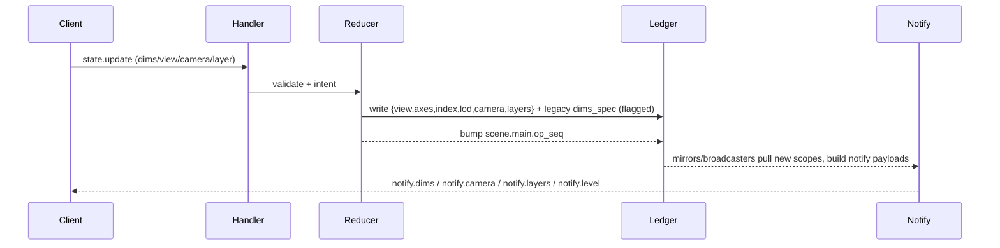
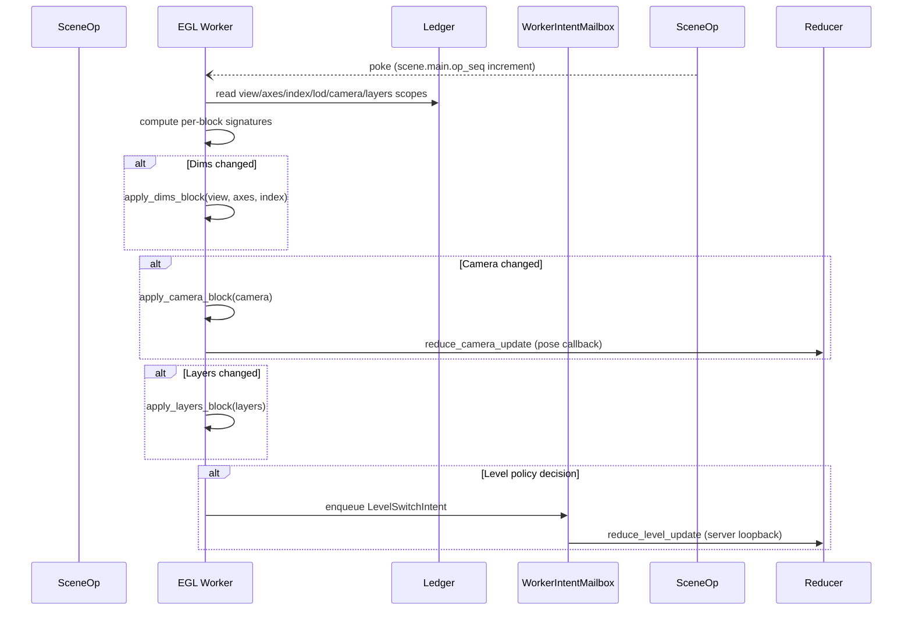

View/Axes/Index/Lod/CAMERA Migration Plan
=========================================

Purpose
-------

Provide an execution-ready plan—diagrams plus task breakdown—for replacing the
legacy `dims_spec` + planner/mailbox stack with the factored ledger model
(`view / axes / index / lod / camera / layers`) and direct worker apply path.
Treat this as the canonical reference for sequencing, scope boundaries, and
temporary shims.

Target Call Stacks
------------------

### Control → Ledger → Notify

Key points:
- Reducers dual-write new scopes **and** legacy `dims_spec` until consumers flip.
- Notify builders read the new scopes first, falling back to `dims_spec`.
- No planner/mailbox involvement; ledger is the only truth source.

### Worker Tick (Ledger → Apply Blocks → Intents)

Key points:
- `RenderUpdateMailbox`, `ViewportPlanner`, `PlaneState`/`VolumeState`, and the
  apply shims disappear.
- Only `WorkerIntentMailbox` remains (level intents, thumbnail captures).
- Ledger scopes are read directly each tick; per-block signatures prevent
  redundant reapply.

Issue Breakdown (Phased)
------------------------

### Phase 0 — Ledger Restructure (no behavioral change)
1. **Move ledger module**: rename `state_ledger/__init__.py` → `ledger.py`; fix imports.
2. **Create `scene/blocks/` package**:
   - `legacy_dims_spec.py` (current `DimsSpec` + helpers).
   - `view_state.py`, `axes_state.py`, `index_state.py`, `lod_state.py`,
     `camera_state.py`, `layer_state.py` (empty shells with dataclasses + serializers).
3. **Add feature flag plumbing** (`LEDGER_VIEW_AXES_V1`) shared by reducers/scene builders/worker.

### Phase 1 — Dual-write new scopes
1. Reducers/transactions write new blocks + legacy `dims_spec`.
2. Unit tests assert parity between `dims_spec` and the new scopes (indexes, modes, margins, level).
3. Scene builders encode the new blocks into `RenderLedgerSnapshot` but keep legacy fields populated.

Temporary patching:
- Worker/runtime still read only legacy fields.
- Notify payloads still emit `dims_spec` at top level.

### Phase 2 — Consumer flip (outside-in)
1. **Notify pipeline**: `notify.dims` emits both the new blocks and legacy spec;
   mirrors/clients start reading `{view,axes,index,lod}` first.
2. **Snapshot builder → worker**: expose the new blocks to the worker under a
   feature flag; start building per-block signatures.
3. **Runtime apply rewrite**:
   - Implement `apply_dims_block`, `apply_camera_block`, `apply_layers_block`
     that accept the new models.
   - Introduce a new worker tick that bypasses `RenderUpdateMailbox`.
   - Keep the legacy planner/mailbox path behind a fallback flag for staged rollout.

### Phase 3 — Legacy removal
1. Delete `ViewportPlanner`, `PlaneState`, `VolumeState`, `RenderUpdateMailbox`,
   bootstrap camera helpers, and all planner/apply shims (as listed in
   `docs/architecture/dims_camera_legacy.md`).
2. Remove `dims_spec` writes and legacy notify fields; collapse `scene/blocks`
   to only the new schema.
3. Update docs/tests to treat the new blocks as the only source of truth.

Deliverables & Tracking
-----------------------

For each phase, file issues with the following template:
1. **Summary** (e.g., “Dual-write view/axes/index blocks in reducers”).
2. **Acceptance criteria** (tests, flags, docs updated).
3. **Dependencies** (must land before Phase N+1 tasks).
4. **Owner + estimated effort**.

This doc plus `docs/architecture/dims_camera_legacy.md` should be kept in sync
during implementation; mark items as completed and prune the legacy list as code
lands.

Current Status (2025-11-10)
---------------------------

- **Feature flag:** `NAPARI_CUDA_ENABLE_VIEW_AXES_INDEX=1` (see
  `scene/blocks/__init__.py::ENABLE_VIEW_AXES_INDEX_BLOCKS`) now switches on the
  Phase 1 dual-write path. Reducers (
  `src/napari_cuda/server/control/state_reducers.py`) write:
  - `view.main.state` (`ViewBlock`)
  - `axes.main.state` (`AxesBlock`)
  - `index.main.cursor` (`IndexBlock`, renamed from “step”)
  - `lod.main.state` (`LodBlock`)
  - `camera.main.state` (`CameraBlock`)
  alongside the legacy `dims_spec`, `camera_plane`, `camera_volume`, and
  `viewport.*` caches.
- **Transactions:** All scene control transactions accept `extra_entries`, so
  block payloads land in the same atomic ledger batch as the legacy keys. This
  ensures notify/mirror code can start reading the new scopes without race
  conditions.
- **Baseline notify:** `orchestrate_connect` seeds `notify.level` directly from
  `viewport.active.state`. When the resumable history store is configured, the
  level baseline is recorded as a snapshot; otherwise we seed the per-client
  sequencer before emitting the first delta. This keeps `notify.level` cursors in
  sync with the new ledger scopes.
- **Parity guardrails:** `uv run pytest -q src/napari_cuda/server/tests/test_state_channel_updates.py`
  passes with the flag both unset/set. This suite asserts that control-channel
  baselines (`notify.scene`, `notify.layers`, `notify.stream`, `notify.dims`,
  `notify.level`) remain identical even though reducers now dual-write the new
  blocks.
- **Restore cache helpers:** `state_reducers.py` now exposes `load_*_restore_cache`,
  `write_*_restore_cache`, and `_plane/_volume_cache_from_state`, and reducers
  (bootstrap, dims, camera, level, plane/volume restore) already dual-write
  cache payloads under the feature flag.
  - Today those helpers clone the just-updated `PlaneState` / `VolumeState`
    instances so cache writes share the same timestamp/intent metadata as the
    legacy `viewport.*` entries. Once `{view, axes, index, lod, camera}`
    blocks become authoritative (Phase 2/3), we will delete the legacy
    dataclasses and update the helpers to build caches straight from the new
    block payloads instead.
  - Next step: teach `reduce_view_update` / toggle handlers to copy the
    target mode’s cache into `{lod,index,camera}` so toggles are truly
    single-pass, then rename the cache types to `PlaneRestoreCacheBlock` /
    `VolumeRestoreCacheBlock`.

Outstanding Phase 1 work:
1. Add explicit unit tests that compare each block to the corresponding
   `DimsSpec` / cached pose fields (axes metadata, current index, margins, camera
   pose).
2. Teach `snapshot_viewport_state` / `build_notify_scene_payload` to read the new
   ledger keys when the flag is set, while legacy scopes remain in place for the
   off-path.
3. Rename the worker-side caches to **PlaneViewportCache** / **VolumeViewportCache**
   (formerly `PlaneState` / `VolumeState`) to make it explicit that these structs
   live only in-memory on the worker for restore/autoframe toggles. They do not
   need dedicated ledger scopes—the ledger remains the source of the currently
   requested state (view/axes/index/lod/camera blocks), while the worker keeps
   the per-mode “last applied” state internally.
4. Document the ledger schema (keys + payloads) in `dims_camera_legacy.md` and
   the protocol docs so consumers know where to look once the flag flips.

Only after those items land should we begin Phase 2 (wiring notify builders and
the worker to consume the block ledger).

Restore Flow (Current → Target)
-------------------------------

Current (legacy planner/mailbox)
- Control: `reduce_view_update` toggles mode; handlers read `viewport.plane/volume.state`
  and call `reduce_*_restore` with cached pose/level/index.
- Worker: applies snapshots, emits intents back for applied camera (`origin="worker.state.camera"`)
  and level decisions (`origin="worker.state.level"`).
- Ledger: becomes authoritative only after those reducers run; notify/render consume ledger then.

Target (ledger‑driven, single‑pass on toggle)
- Persist per‑mode restore caches on the ledger so toggles don’t need a second pass:
  - `restore_cache.plane.state` → `{ level: int, index: tuple[int,...], pose: {rect,center,zoom}, optional: roi_signature, zoom_hint }`
  - `restore_cache.volume.state` → `{ level: int, index: tuple[int,...], pose: {center,angles,distance,fov}, optional: roi_signature }`
- Control (flag on): `reduce_view_update` writes `ViewBlock` and then copies the target mode’s
  restore cache into the authoritative blocks (`LodBlock.level`, `IndexBlock.value`, `CameraBlock.*`) in one transaction.
- Worker: still maintains minimal in‑memory caches for real‑time deltas, ROI hysteresis, and signature diffing,
  but no longer needs to “confirm” restore for toggles. It can continue to emit camera/level intents as telemetry.
- Notify/render: read the authoritative blocks immediately after the toggle and render atomically.

Notes
- If the restore caches are not persisted on the ledger, toggles become a two‑pass handshake
  (request → worker apply → worker intent back → control writes authoritative blocks). Persisting the caches
  avoids this roundtrip and keeps toggles single‑pass.
