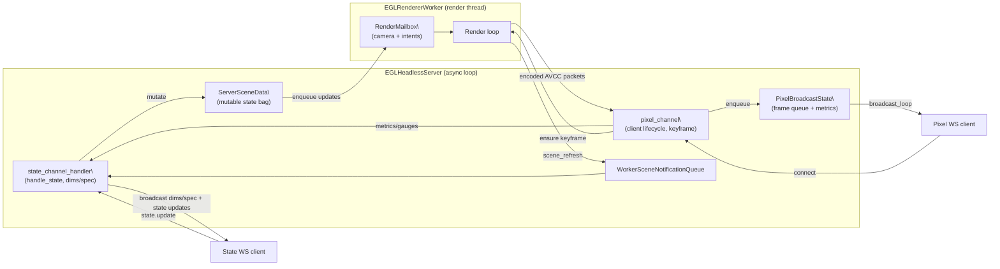

# napari-cuda Server Architecture

This document captures the current layout of the headless rendering server after the Phase B/C refactor work. It aligns with the "degodify" tenets by documenting which module owns each responsibility and how data moves between them.

## High-level Overview

```text
Websocket Clients (state + pixel)
            │
            ▼
+-------------------------+
| EGLHeadlessServer       |
| - Websocket I/O         |
| - Session + metrics     |
| - SceneSpec broadcast   |
| - State snapshot store  |
+-----------┬-------------+
            │ scene/dims
            ▼
+-------------------------+
| ViewerSceneManager      |
| - Builds SceneSpec      |
| - Maintains ViewerModel |
+-----------┬-------------+
            │ orchestration
            ▼
+-------------------------+
| EGLRendererWorker       |
| - Render loop           |
| - Schedules helpers     |
+-----------┼--------------------------+
            │                          │
            ▼                          ▼
   +------------------+      +----------------------------+
   | RenderMailbox        |      | WorkerSceneNotification   |
   | (control → worker) |      | Queue (worker → control)  |
   | + CameraController|      +----------------------------+
   | + SceneStateApplier|                 | drain
   +-----------------------+             ▼
            │                 +-------------------------+
            ▼                 | CaptureFacade           |
   +------------------+       | + GLCapture             |
   | ROI helpers      |       | + CudaInterop           |
   | LOD policy       |       | + FramePipeline         |
   +------------------+       +-----------┬-------------+
                                          │ frame packets
                                          ▼
```

## Component Responsibilities

- **EGLHeadlessServer** (`src/napari_cuda/server/egl_headless_server.py`)
  - Owns websocket listeners for state and pixel channels.
  - Tracks authoritative scene state, metrics, and watchdogs.
  - Delegates SceneSpec construction to `ViewerSceneManager`, render work to `EGLRendererWorker`, and render-thread lifecycle to `worker_lifecycle.start_worker/stop_worker`.
  - Maintains config (`ServerCtx`) and async orchestration (broadcasts, keyframe watchdog).

- **ServerSceneData** (`src/napari_cuda/server/server_scene.py`)
  - Mutable bag the server mutates for every state-channel request: carries the latest `ServerSceneState`, camera command deque, global sequencing counter, volume/multiscale metadata, SceneSpec caches, and policy logging state.
  - Tracks canonical per-layer controls via `LayerControlState`; the unified `state.update` surface (which replaces the old `control.command` + intent paths) mutates this bag before the worker and spec builders consume it.
  - Intent helpers, MCP tools, and broadcast helpers operate exclusively on this bag, emitting immutable snapshots for the worker when changes are ready.
  - Lives alongside `render_mailbox.py` and `server_scene_spec.py`; the bag stays free of protocol helpers so the worker can import the queue without dragging in viewer/serialization code.
  - Worker-facing helpers (`scene_state_applier.py`, ROI/LOD modules) remain outside the namespace to keep render-thread code decoupled from headless-server orchestration.
- Layer controls surface through a dedicated `controls` map on every `scene.spec` / `state.update` and
  now carry `control_versions` metadata (`server_seq`, `source_client_seq`, `source_client_id`) so
  reconnects and multi-client interactions can reconcile authoritative state quickly. `extras`
  continues to hold transport metadata only (volume flags, zarr paths, adapter hints).
- **Control Channel Helpers** (`state_channel_handler.py`)
  - Orchestrate state-channel websocket flow: connection setup, `state.update` dispatch, dims/spec broadcasting, and policy/metrics logging.
  - Operate on `ServerSceneData` bags directly while delegating worker hops back through the server object; `EGLHeadlessServer` now simply forwards events into these helpers.
  - Expose procedural APIs (`handle_state`, `broadcast_dims_update`, `rebroadcast_meta`, etc.) so other agents (CLI tools, MCP servers) can reuse the control surface without touching app globals.
  - Delegate state mutations to `server_state_updates.py`, keeping dims/volume *and layer* updates as pure helpers that operate on `ServerSceneData` and a re-entrant lock.
  - Worker refresh notifications travel through a dedicated worker→control queue, so the control loop updates the scene manager before emitting dims/spec payloads; no deferred flushes or ad-hoc regeneration needed.
- **Worker Lifecycle Helpers** (`worker_lifecycle.py`)
  - `WorkerLifecycleState` tracks the render thread, worker instance, and stop event in a single bag controlled by the lifecycle helpers.
  - `start_worker` spins up `EGLRendererWorker`, wires callbacks (`on_frame`, `_on_scene_refresh`), emits baseline dims updates, and pushes packets through `pixel_channel` without touching asyncio internals.
  - `stop_worker` signals the render loop, joins the thread, and ensures cleanup so the server shell only needs a thin delegating wrapper.

- **Pixel Channel Helpers** (`pixel_channel.py` + `pixel_broadcaster.py`)
  - `PixelChannelState` + `PixelChannelConfig` own websocket lifecycle data (clients, bypass, keyframe watchdogs, avcC cache) while the broadcaster continues to handle raw frame draining.
  - `EGLHeadlessServer` relies on these helpers to attach/detach clients, enqueue frames from the encoder thread, force keyframes, and rebroadcast video configuration snapshots.
  - Isolating pixel logic keeps the server shell thin and enables unit tests that exercise queue overflow, watchdog cooldowns, and config caching without real websockets.

## System Overview

The headless server works as two cooperating loops around a single scene record:

1. **State channel (async loop)** – receives `state.update` payloads from the UI, normalises them,
   and mutates the authoritative `ServerSceneData`. Each mutation produces a delta that is recorded for
   acknowledgements and handed to the render worker through its update mailbox. The async loop also
   broadcasts the canonical scene spec, dims metadata, and the layer `controls` map (including
   `{server_seq, source_client_seq, interaction_id, phase}` metadata) back to clients, and forwards
   encoded frames to the pixel broadcaster.

2. **Render worker (dedicated thread)** – maintains the napari `ViewerModel` and the VisPy visual. It
   drains the update mailbox each tick, applies the coalesced deltas via `SceneStateApplier`, renders
   a frame, and passes the result into the capture/encode façade before the pixel channel ships it to
   clients. Whenever the worker changes state internally (for example, multiscale policy or ROI
   adjustments) it notifies the async loop so the scene record stays authoritative before the next
   broadcast.

A small viewer builder runs once at worker start-up to construct the napari viewer and VisPy node and
hand those handles to the worker so the render loop can focus purely on draining updates and
producing frames.

### Pixel Channel & Control Flow




- **ViewerSceneManager** (`src/napari_cuda/server/layer_manager.py`)
  - Maintains a headless `ViewerModel` mirror for scene metadata.
  - Produces `SceneSpec`/`dims.update` payloads used by clients and the server HUD.

- **EGLRendererWorker** (`src/napari_cuda/server/render_worker.py`)
  - Runs on a dedicated thread with EGL + CUDA contexts.
  - Coordinates render ticks, applies pending scene updates, and liaises with ROI/LOD helpers.
  - Delegates capture/encode to `CaptureFacade` and camera/scene logic to extracted helpers.

- **SceneState Helpers** (`scene_state_applier.py`, `render_mailbox.py`, `server_scene_spec.py`, `camera_controller.py`)
  - `RenderMailbox` coalesces pending updates across threads before the worker drains them.
  - `WorkerSceneNotificationQueue` carries worker-driven refresh notices back to the control loop so metadata and broadcasts stay aligned.
  - `server_scene_spec.py` builds `scene.spec`, `dims.update`, and `state.update` payloads from `ServerSceneData` for WebSocket and MCP callers.
  - `SceneStateApplier` applies dims/camera/volume changes and layer property overrides to viewer + layer objects.
  - `CameraController` executes queued camera commands and reports policy triggers.

- **ROI & Level Helpers** (`roi.py`, `lod.py`, `level_budget.py`, `worker_runtime.py`)
  - Compute viewport ROI, manage multiscale level selection, and enforce per-level budgets.
  - Provide pure helpers that the worker invokes during render ticks.

- **Capture & Encoding** (`capture.py`, `rendering/*`)
  - `CaptureFacade` encapsulates VisPy FBO capture, CUDA interop, and the NVENC frame pipeline.
  - `encode_frame` returns packets + timing metadata consumed by the server for pacing.

- **Configuration & Policy** (`config.py`, `logging_policy.py`)
  - `ServerCtx` is resolved once at startup and bundles the structured `ServerConfig` with
    `DebugPolicy`, `EncoderRuntime`, and `BitstreamRuntime` dataclasses. Downstream modules use these
    immutable snapshots instead of reading environment variables directly.
  - `logging_policy.py` materialises every debug/logging toggle; worker, rendering, and bitstream
    code paths now consume the policy object exclusively.
  - `presets.py` registers named runtime presets (streaming profiles and NVENC tiers) and merges their
    overrides into `ServerCtx` so the server honours `NAPARI_CUDA_PRESET` without scattering env checks.
- **Metrics Helpers** (`metrics_core.py`, `metrics_server.py`, `dash_dashboard.py`)
  - `metrics_core.Metrics` is the dependency-free aggregator used by the server, dashboard, and tests.
  - `metrics_server` wires Dash startup and policy gauge updates so `egl_headless_server` only calls concise helpers.
  - The Dash app remains in `dash_dashboard.py`, consuming the shared aggregator without reaching into server internals.

## Data Flow Summary

1. Clients connect via websocket; `EGLHeadlessServer` registers them and pushes an initial `SceneSpec`.
2. Incoming state updates mutate `ServerSceneData` (dims sequence, volume/multiscale hints, camera queue) and enqueue work in `RenderMailbox` when the worker needs to react.
3. The worker thread drains updates from `RenderMailbox`, applies them through `SceneStateApplier`, and kicks ROI/LOD recalculation as needed.
4. When the worker finishes applying a scene update, it enqueues a notification on the worker→control queue; the asyncio control loop drains it, refreshes `ViewerSceneManager`, and broadcasts the authoritative dims/spec payload.
5. `CaptureFacade` captures rendered frames, hands them to NVENC, and returns packet bytes to the server.
   - The NVENC helper (`rendering/encoder.py`) reads preset/bitrate/RC overrides from
     `ServerCtx.encoder_runtime` and honours `DebugPolicy.encoder` logging toggles.
6. The server broadcasts encoded frames over the pixel channel and sends authoritative dims/camera
   updates via the state channel when changes land.
   - Bitstream packing consults `ServerCtx.bitstream` to decide between the Cython fast path and
     Python fallback; SPS/NAL logging comes from `DebugPolicy.encoder`.
7. Metrics and watchdogs live in the server layer to detect stalled keyframes, drop counts, or policy anomalies.

## Future Refinements

- Phase D is underway: logging/debug toggles live in `logging_policy.py`, and rendering/bitstream
  modules rely on the `ServerCtx` snapshots. Remaining work focuses on the logging-guard audit and
  lint/test enforcement.
- Phase E targets further decomposition of `EGLHeadlessServer` into discrete broadcaster/state-manager components, with `ServerSceneData` acting as the authoritative state bag shared by future intent/MCP helpers.
- Capture resizing and dynamic canvas negotiation remain TODO items once client capabilities land.
