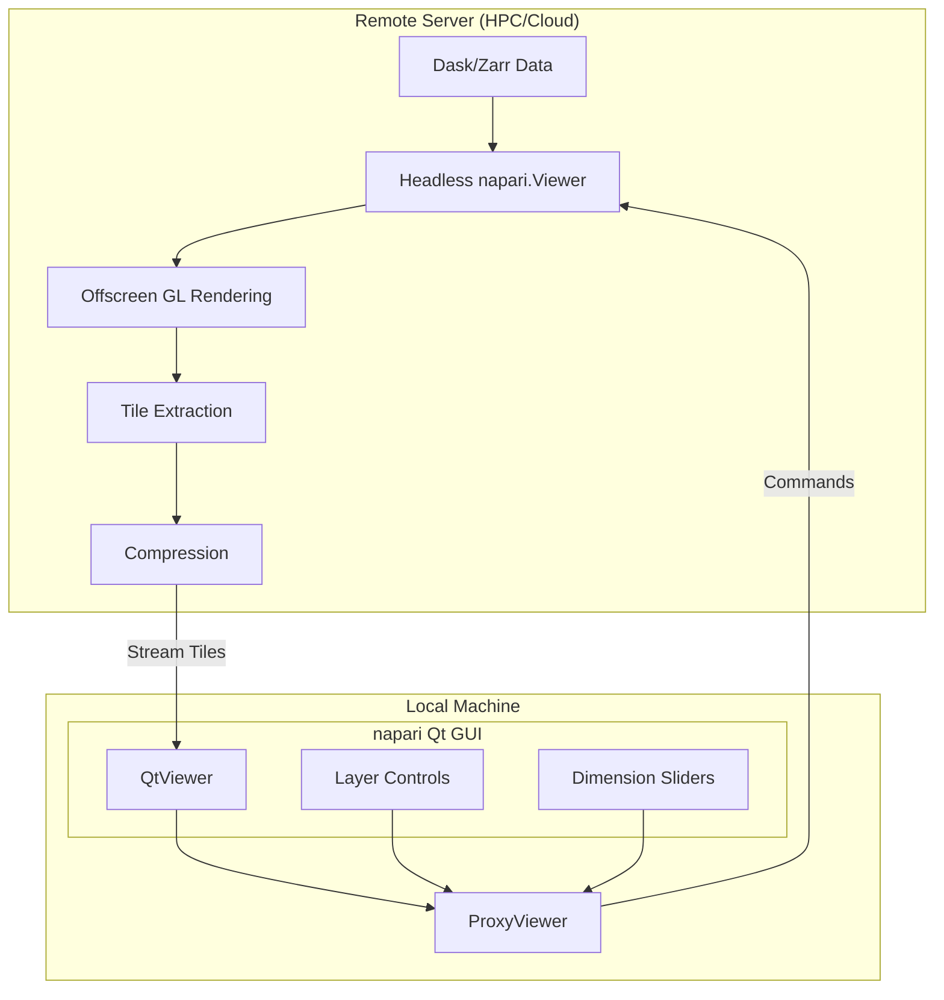

# napari-engine

## Vision 🚀
Transform napari into a high-performance, distributed visualization engine for massive microscopy datasets. The goal is to create a "game engine" for scientific imaging - allowing standard napari to interact fluidly with remote, petabyte-scale datasets as if they were local.

## Architecture Overview

napari-engine decouples napari's frontend (Qt GUI) from its backend (Viewer model). The local napari GUI communicates with a `ProxyViewer` that forwards commands to a headless napari instance running on a remote server with direct data access.



## Technical Analysis

Based on deep investigation of napari's source code:

### ✅ What Will Work

1. **Headless Rendering** - napari already supports `Viewer(show=False)` and can render offscreen
2. **Screenshot Capability** - `viewer.screenshot()` uses Qt's `grabFramebuffer()` which works headless
3. **Viewer Model API** - Well-defined, event-driven architecture makes proxying feasible
4. **Dask Integration** - Already lazy-loads data, perfect for remote datasets

### Key Interception Points

After analyzing the codebase, the optimal approach is:

```python
# Server side - Headless napari with custom canvas
class StreamingCanvas(VispyCanvas):
    def screenshot(self):
        # Override to return tiles instead of full frame
        img = self.native.grabFramebuffer() 
        tiles = self.extract_tiles(img)
        return self.compress_tiles(tiles)

# Client side - Proxy that mimics ViewerModel
class ProxyViewer(ViewerModel):
    def __init__(self, server_address):
        self._remote = RemoteConnection(server_address)
        # Forward all ViewerModel events to server
        
    @property
    def camera(self):
        # Proxy camera commands to server
        return ProxyCamera(self._remote)
```

## Implementation Roadmap

### Phase 1: Proof of Concept ✅
- [x] Verify headless rendering works
- [x] Understand Viewer → QtViewer → VispyCanvas pipeline
- [x] Identify ViewerModel API surface

### Phase 2: Basic Remote Rendering
- [ ] Create headless napari server that renders to FBO
- [ ] Implement WebSocket/ZeroMQ protocol for commands
- [ ] Build ProxyViewer that forwards basic commands (camera, dims)
- [ ] Stream full frames (no tiling yet)

### Phase 3: Tiled Streaming
- [ ] Extract viewport tiles from rendered frames
- [ ] Implement tile compression (JPEG/WebP)
- [ ] Add tile caching on client
- [ ] Dirty region tracking

### Phase 4: ProxyViewer Integration
- [ ] Complete ProxyViewer API (all ViewerModel methods)
- [ ] Handle layer operations remotely
- [ ] Sync events bidirectionally
- [ ] Mouse/keyboard interaction forwarding

### Phase 5: Performance Optimization
- [ ] Dask prefetching based on navigation prediction
- [ ] Multiple render contexts for parallel tile generation
- [ ] Adaptive quality based on bandwidth
- [ ] Delta compression for temporal data

## Risk Assessment

### 🟢 Low Risk
- **Headless Operation**: Already works with `show=False`
- **Dask/Zarr**: Designed for this use case
- **WebSocket Streaming**: Well-proven technology

### 🟡 Medium Risk  
- **Qt Event Loop**: May need careful handling in headless mode
- **OpenGL Context**: Platform-specific quirks possible
- **Latency**: Network RTT could affect interactivity

### 🔴 High Risk
- **GL Context Sharing**: Multi-threaded rendering complex
- **State Synchronization**: Keeping client/server in sync
- **Layer Interactivity**: Editing tools may be challenging

## Quick Start

```bash
# Install napari-engine
pip install -e .

# Start server on machine with data
python -m napari_engine.server --data /path/to/data.zarr --port 8765

# Connect client
python -m napari_engine.client --host server.example.com --port 8765
```

## Minimum Viable Prototype

```python
# server.py - Minimal headless server
import napari
import asyncio
import websockets
import json

class NapariServer:
    def __init__(self):
        self.viewer = napari.Viewer(show=False)
    
    async def handle_command(self, websocket):
        async for message in websocket:
            cmd = json.loads(message)
            
            if cmd['type'] == 'set_camera':
                self.viewer.camera.center = cmd['center']
                self.viewer.camera.zoom = cmd['zoom']
            
            # Render and send frame
            screenshot = self.viewer.screenshot(canvas_only=True)
            await websocket.send(screenshot.tobytes())

# client.py - Proxy viewer
class ProxyViewer:
    def __init__(self, server_url):
        self.ws = websocket.connect(server_url)
        
    def update_camera(self, center, zoom):
        self.ws.send(json.dumps({
            'type': 'set_camera',
            'center': center,
            'zoom': zoom
        }))
        frame = self.ws.recv()
        self.display(frame)
```

## Why This Will Actually Work

1. **napari's Architecture Supports It**: Clean separation between ViewerModel and rendering
2. **Headless Already Proven**: Tests confirm offscreen rendering works
3. **Event System Is Robust**: All state changes go through events - perfect for proxying
4. **Dask Does Heavy Lifting**: Data stays remote, only pixels stream

## Next Steps

1. Run `streaming/tests/test_headless.py` to verify headless rendering
2. Build minimal WebSocket server with single frame streaming  
3. Create ProxyViewer that forwards camera events
4. Test with real microscopy data on remote server

---

The key insight from the investigation: **napari is already 90% ready for this**. The architecture is clean, headless works, and the main challenge is engineering the streaming protocol - not hacking napari internals.